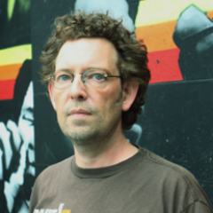

Back in March 2016, our friends [UX Camp Brighton](http://www.uxcampbrighton.org/) held their largest, most successful barcamp yet. In keeping with tradition, here at UX Brighton we're extremely happy to host the follow-up Redux event featuring sessions from the day. With over 80 speakers, selecting four has been hard work! We hope you agree we've chosen a selection of popular talks, which include fascinating subjects from many new voices.

## Making The Source for Macmillan Cancer Support, Rob Pearson

<iframe src="//www.slideshare.net/slideshow/embed_code/key/7eXN6XVJxjhS42" frameborder="0" scrolling="no" allowfullscreen></iframe>

 Rob will be explaining how his team at [Amido](https://www.amido.com/) used lean, collaborative UX to make The Source, a new digital product for Macmillan Cancer Support. Rob hopes you will gain a sense of empowerment from his talk and learn that UX isn’t an expert discipline from which you're excluded if you don’t have UX in your job title. In fact it’s really an approach to gathering evidence around design decisions.

Rob is currently Head of UX at Amido, a technical consultancy based in London and Brighton, specialising in customer identity, search and cloud services. Before this, he freelanced for a string of agencies and consultancies, being lucky enough to work with lots of charities and NGOs like Great Ormond St, Medecins Sans Frontieres and Stonewall. He's currently working on projects for the Wellcome Trust and the Marine Stewardship Council.

[@robotperson](http://twitter.com/robotperson)

## Factors of Trust in IoT App Interfaces, Fiona MacNeill

<iframe src="https://player.vimeo.com/video/160628235" frameborder="0" scrolling="no" allowfullscreen></iframe>

Does your app rely on OAuth to offer connection to other apps and services? Based on her research studying app-to-device relationships in Internet of Things systems (e.g. Fitbit, Jawbone UP, Nest, SmartThings, Glooko), Fiona has uncovered some valuable best practice recommendations for inspiring trust within your interface.

Fiona has been working in the Educational Technology field within Higher Education for seven years. A big part of her job is finding new and innovative ways of integrating technology into current teaching and learning methodology. She enjoys being able to help her clients achieve small and meaningful efficiencies; sometimes that makes all the difference. If that weren't enough, Fiona has been a practising performance and new media artist for ten years. Her work is often site specific in nature and has a strong basis in public art rhetoric.

[@fmacneill](http://twitter.com/fmacneill)

## ProdPad - proud to sponsor UX Brighton. We're hiring!
ProdPad is the SaaS tool for product managers and their companies.  We're proud to support UX Brighton, and look forward to meeting you on the 14th. We're [hiring a full-time UX Designer!](https://www.prodpad.com/join-us/)

## Effective wireframes: pitfalls to avoid and tips for success, Al Power

<iframe src="<iframe src="https://player.vimeo.com/video/170385312" width="640" height="360" frameborder="0" webkitallowfullscreen mozallowfullscreen allowfullscreen></iframe>" frameborder="0" scrolling="no" allowfullscreen></iframe>

In this session Al will look at some of the pitfalls of communicating design well through wireframes – examining some possible solutions and provide some tips for success.

Al is a web designer who likes good UI design and web standards. He can often be found behind a camera and loves landscape photography and the occasional portrait shoot. Al is based in Seaford, East Sussex, on the beautiful south coast of the UK.

[@alpower](http://twitter.com/alpower) 

## How to get better answers from asking better questions, Chris How

<iframe src="//www.slideshare.net/slideshow/embed_code/key/6hlBtBtrpls7nk" frameborder="0" scrolling="no" allowfullscreen></iframe>

Want to become a question-asking Ninja? Asking questions is at the heart of uncovering ideas and opportunities that can then be translated into digital products and services, software and interfaces. In Chris's session he will be giving practical tips to answer:
- What makes a good question?
- How can I get better answers from my questions?
- How can I get better at asking questions?

And as a bonus Chris will be running ‘Shit question bingo’ as part of his session.

Chris is Lead UX consultant at [Webcredible](http://webcredible.com). His job allows him to indulge his insatiable curiosity for people, design and technology. Chris is often found talking about user experience, digital design and culture. When no-one is looking he is often found tinkering online. Recent dabbling includes the website for [Sussex Peggers Riding Club](http://www.sussexpeggers.com/) where he competes at mounted skill-at-arms and [101 days of food](http://www.chrishow.co.uk/101daysoffood/whatiate.xml) - a project where he kept a photo diary of meals eaten to track his food habits.

[@chrishow](http://twitter.com/chrishow)

## Organisers

- <a href="http://uxbrighton.org.uk/about/#tim">Tim</a>
- <a href="http://uxbrighton.org.uk/about/#patrick">Patrick</a>
- <a href="http://uxbrighton.org.uk/about/#luke">Luke</a>
- <a href="http://uxbrighton.org.uk/about/#tom">Tom</a>
