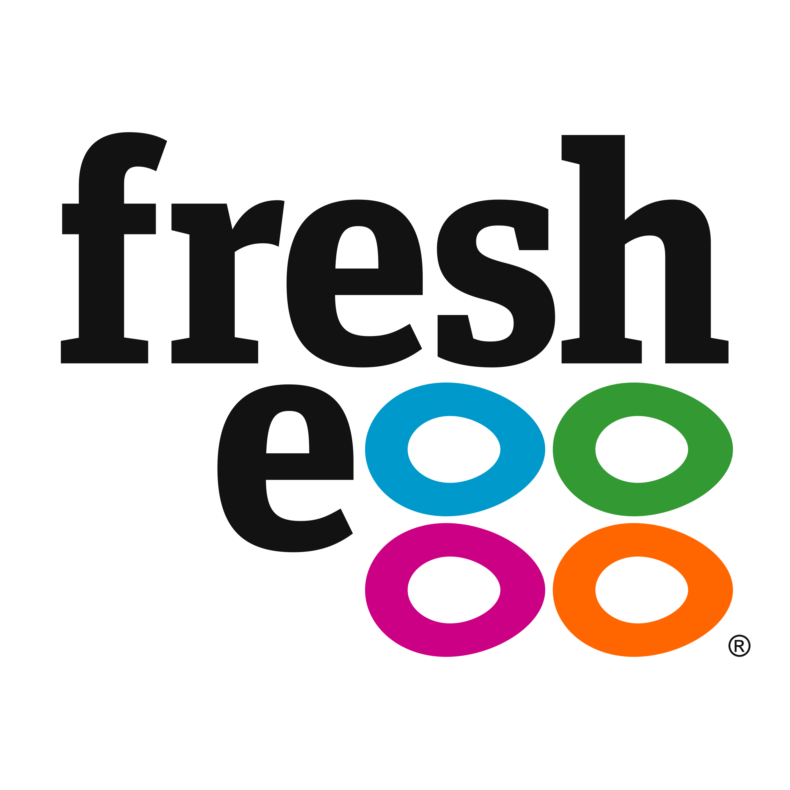
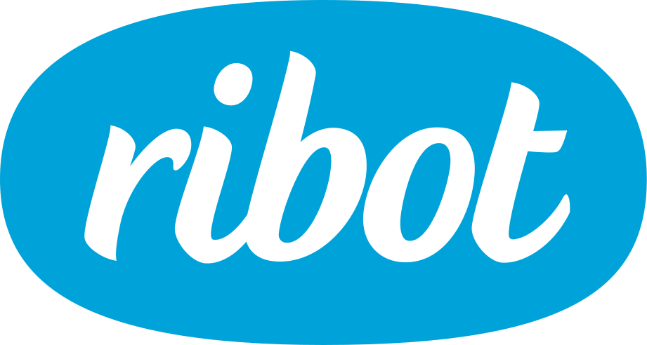

[Writeup from a mentor’s point of view (blog post by Rachel McConnell of RSA)](https://web.archive.org/web/20161222002302/https://rsa.digital/2016/11/21/rsa-digital-goes-to-ux-brighton-career-clinic/ )

Following the success of our [last UX Career Clinic](http://www.nppdigital.com/blog/user-experience/ux-brighton-career-clinic-2014/), [we're back again](http://brightondigitalfestival.co.uk/event/ux-career-clinic-supercharge-ux-career/) as part of the [Brighton Digital Festival](http://brightondigitalfestival.co.uk/).

<strong>The UX Career Clinic will give advice to those looking to get into the UX industry, or move within it</strong>. Job seekers will receive unique insights from the best UX industry professionals in Brighton, who will be able to give feedback on portfolios and give career advice to help you get a foot on the UX ladder.

Approximately 20 company representatives and UX freelancers will be on-hand <strong>to give one-to-one advice</strong> to those looking to get into the industry or move within it.

Our <strong>confirmed mentors</strong> are:

Here's what one attendee from our previous career clinic had to say:

<blockquote>&ldquo;It really helped me get a good overview of the types of companies out there and the sorts of work they do, as well as what they look for in an applicant. The careers clinic also helped me widen my idea of the types of job I should search for. Initially I’d only been on the lookout for UX researcher roles, since that was my main academic background, but after talking to people at the clinic I realised that I could also search for junior roles that incorporated design and research.&rdquo;</blockquote>

<strong>If you are coming, be sure to read our [tips for attendees](/careers-clinic-2016-attendees-guide)</strong>.

Here’s [what mentors from The Unit had to say about our last career clinic](http://www.theunit.co.uk/our-thinking/2015/portfolio-clinic-at-ux-brighton).

And here’s a [writeup from digital agency No Pork Pies](http://www.nppdigital.com/blog/user-experience/ux-brighton-career-clinic-2014/).

