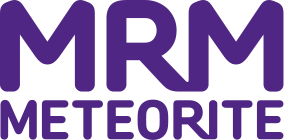

Following the success of our [last UX Career Clinic](http://www.nppdigital.com/blog/user-experience/ux-brighton-career-clinic-2014/), we're back again as part of the [Brighton Digital Festival](http://brightondigitalfestival.co.uk/).

<strong>The UX Career Clinic will give advice to those looking to get into the UX industry, or move within it</strong>. Job seekers will receive unique insights from the best UX industry professionals in Brighton, who will be able to give feedback on portfolios and give career advice to help you get a foot on the UX ladder.

Approximately 20 company representatives and UX freelancers will be on-hand <strong>to give one-to-one advice</strong> to those looking to get into the industry or move within it.

Our <strong>confirmed mentors</strong> include:

[Clearleft](http://clearleft.com), [Ribot](http://ribot.co.uk), [Crunch](https://www.crunch.co.uk/), [The Unit](http://www.theunit.co.uk/), [Danny Hope](http://dannyhope.co.uk/), [Andy Parker](http://byandyparker.com/), [Sjors Timmer](http://notura.com/), [Patrick Sansom](https://www.linkedin.com/in/patricksansomdesigner), [Ben Scammels](http://www.benscammelsdesign.com/), [Cheryl Galloway](http://cherylgallaway.com/), [Amex](https://www.americanexpress.com/uk/), [RSA](https://www.rsagroup.com/), [Fresh Egg](http://www.freshegg.co.uk/), [Liquid Light](https://www.liquidlight.co.uk/), [Chris How](https://www.linkedin.com/in/chrishow), [Fiona MacNeill](https://www.linkedin.com/in/fionamacneill) with more to come.

The timeslots are in place to help us minimise the time you'll need to wait to talk to mentors. We won't be restricting your access in any way, we just want to help you get the most of the event. Once you've seen a mentor or two, you're free to hang out and network with other attendees.

# NB Your ticket deposit will be fully refunded so long as you attend. 
