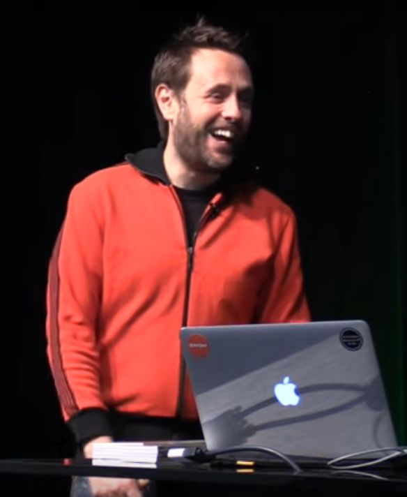
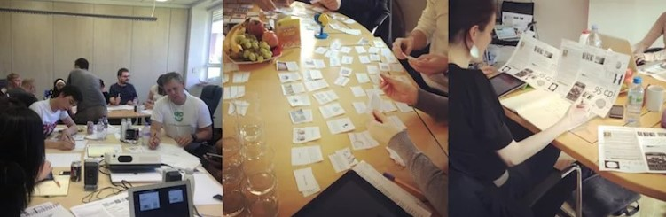

__How to use psychology to improve your website, app or product__

We’ve partnered with UX Consultant and author [Joe Leech](https://mrjoe.uk/) to bring you a workshop on using psychology for better UX.

In this one-day event we'll look at how people build mental models of the world around them and how we can use that knowledge to create great user experiences.

## About the workshop

The workshop will provide a practical, hands on way to understand how the human brain works and apply that knowledge to User Experience and product design.

In the workshop, you’ll learn the psychological principles behind how our brain makes sense of the world, and apply that to product and user interface design.

This is a hands-on workshop so expect to be sketching, designing and applying the psychology from the very start.

After the workshop you’ll be able to:

  1. Design products, apps and websites that match how people think and behave
  2. Find, understand, evaluate and apply psychology theory to digital product design
  3. Make informed design decisions and advocate to the wider team using psychology theory

After this workshop and you’ll be able to put psychology into practice as soon as you get back to the office.

## What you’ll learn

We'll go right back to the fundamental psychology theories underpinning planning, decision making and perception. We'll build from there on how users decide what to do in certain situations. We’ll also cover why many websites fail because they don't match the model and thus the expectation the user has for how they will work.

Through a series of practical exercises you’ll learn:

1. Why you should match design to behaviour and what goes wrong when you don't
2. The psychological theory behind how people model a task
3. How to match your design to the map/model and make it a success
4. Mapping and designing the details using a psychological approach
5. Loads of little psychology tidbits that will improve a design and make you a better designer

## Who should attend this workshop

UX people who want to understand how to use psychology to influence their design decisions. No previous psychology experience is needed and this workshop is particularly suitable for:

* Product owners
* Entrepreneurs
* Copywriters
* Content strategists
* UX designers
* Interface designers
* Visual designers
* App designers
* Researchers

## About Joe

Joe Leech has spent the last 13 years working in UX with organisations like eBay, MoMA, Marriott and Disney. A former UX Director at cxpartners he has a degree in Neuroscience an MSc in Human Computer Interaction and wrote the book [Psychology for Designers](http://psychologyfordesigners.com/).

<iframe src="https://www.youtube.com/embed/3-0NQ_bb4C8?list=PLxIVE2ZZ0maCWjZhoIAiL0lkif9_a2k7F" frameborder="0" scrolling="no" allowfullscreen></iframe>

## What people have said about Joe’s workshops

> It was an excellent workshop that was well paced, engaging and allowed us to put our learnings into practice. It was one of the best workshops I’ve attended.

> Everything was really good! I learnt a lot new things from your experience / research. True eye opener!

> Comprehensive, engaging, and tons of fun. The workshop gave me a lot to think about in terms of my workflow and design process.

## What people have said about UX Brighton workshops

> Great workshop - it exceeded all my expectations!
—Caroline Owen

> The trainer was lovely, inspiring and very professional. The way she both shared us her insights and got us working together served the purpose perfectly.
—Heikki

> Helped me understand and share experiences with other UXers.
—Paul Swain

> Sound, focussed and practical advice about preparing for, facilitating and then following-up on workshops. Alison was a fun, enthusiastic and knowledgeable tutor. Recommended :-)
—Patrick Sansom

> Really insightful workshop. It was useful to have practical examples rather than just an overview
—Tracy Godding

## Organisers

- <a href="http://uxbrighton.org.uk/about/#luke">Luke</a>
- <a href="http://uxbrighton.org.uk/about/#danny">Danny</a>
